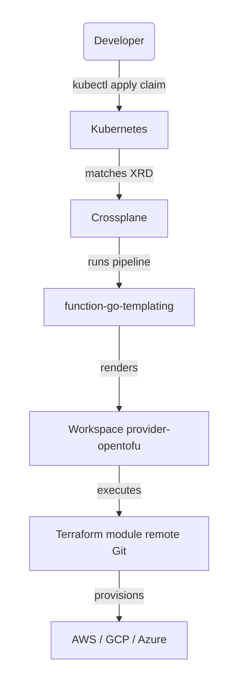
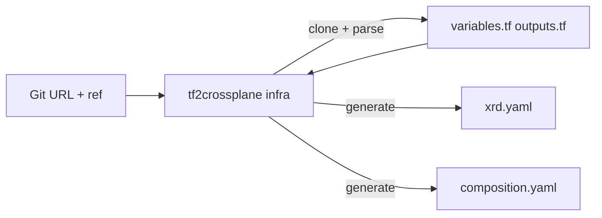

# tf2crossplane

Generate Crossplane **XRD** + **Composition** manifests from Terraform modules — no manual YAML writing.

Two subcommands cover the full Crossplane platform engineering workflow:

| Subcommand | Input | Output |
|---|---|---|
| `infra` | Terraform module Git URL | XRD + Composition → 1 Workspace (provider-opentofu) |
| `stack` | XRD YAML files + wiring definition | XRD + Composition → N Infra XRs (Composition of Compositions) |

## The problem

Crossplane's [provider-opentofu](https://github.com/upbound/provider-opentofu) lets you drive Terraform modules from Kubernetes. The runtime workflow looks like:



But writing a `CompositeResourceDefinition` and a `Composition` by hand for each module is tedious:

- parse every `variable {}` block in the module
- translate each Terraform type (`string`, `list(object(...))`, …) to an OpenAPI v3 schema fragment
- wire each variable to its Go template expression in the `varmap`

For a module with 90 variables this is hundreds of lines of error-prone boilerplate. `tf2crossplane` automates all of it.

## Installation

**From a GitHub release** (replace `<version>` with the [latest release](https://github.com/cdelgehier/tf2crossplane/releases/latest)):
```bash
pip install https://github.com/cdelgehier/tf2crossplane/releases/download/v<version>/tf2crossplane-<version>-py3-none-any.whl
```

**From source (requires [uv](https://docs.astral.sh/uv/)):**
```bash
git clone https://github.com/cdelgehier/tf2crossplane.git
cd tf2crossplane
uv sync
```

---

## `infra` — Generate from a Terraform module

### What it generates

Given a module URL, `tf2crossplane infra` produces two files:

| File | Content |
|------|---------|
| `xrd.yaml` | `CompositeResourceDefinition` — declares the API (group, kind, schema) |
| `composition.yaml` | `Composition` — pipeline using `function-go-templating` to render a `Workspace` |



### Prerequisites

- Crossplane **v2** (XRDs use `apiextensions.crossplane.io/v2`, scope `Namespaced` by default)
- `provider-opentofu` installed with a `ProviderConfig` configured
- `function-go-templating` installed

> **Crossplane v2 note** — generated XRDs include a `defaultCompositionRef` pointing to the generated Composition. Users create XRs directly (no separate Claim object in v2). If the XR stays `SYNCED=<empty>` after apply, restart the Crossplane pod once to refresh watches: `kubectl rollout restart deployment/crossplane -n crossplane-system`.

### Getting started

```bash
tf2crossplane infra \
  --module-url 'git::https://github.com/terraform-aws-modules/terraform-aws-alb.git?ref=v9.13.0' \
  --output-dir out/alb/ \
  --group platform.example.io \
  --kind ApplicationLoadBalancer \
  --provider-config aws-prod
```

Output:
```
out/alb/
├── xrd.yaml          # CompositeResourceDefinition (46 variables, 11 outputs)
└── composition.yaml  # Composition (function-go-templating pipeline)
```

```bash
kubectl apply -f out/alb/xrd.yaml
kubectl apply -f out/alb/composition.yaml
```

XR (Crossplane v2 — create the composite resource directly, no separate Claim object):
```yaml
apiVersion: platform.example.io/v1alpha1
kind: XApplicationLoadBalancer
metadata:
  name: my-alb
  namespace: my-team
spec:
  providerConfig: aws-prod
  name: my-alb
  vpc_id: vpc-0abc1234def56789
  subnets:
    - subnet-0aaaa111
    - subnet-0bbbb222
```

### Options

```
tf2crossplane infra --module-url <git-url> [OPTIONS]
```

| Option | Default | Description |
|--------|---------|-------------|
| `--module-url` | *(required)* | Git URL of the Terraform module, with `?ref=` |
| `--output-dir` | `.` | Directory where `xrd.yaml` and `composition.yaml` are written |
| `--group` | `example.crossplane.io` | Crossplane API group |
| `--version` | `v1alpha1` | API version |
| `--kind` | *(auto-detected)* | Override the CamelCase kind (e.g. `S3Bucket`) |
| `--provider-config` | `my-provider-config` | Name of the `ProviderConfig` on the cluster |
| `--provider-config-kind` | `ProviderConfig` | Kind for `providerConfigRef` (`ProviderConfig` or `ClusterProviderConfig`) |
| `--composition-update-policy` | `Automatic` | `defaultCompositionUpdatePolicy` in the XRD |
| `--scope` | `Namespaced` | XRD scope (`Namespaced` or `Cluster`) |
| `--workspace-source` | `Remote` | `source` field of the Workspace `forProvider` |
| `--workspace-api-version` | `opentofu.m.upbound.io/v1beta1` | `apiVersion` of the Workspace resource |
| `--function-go-templating` | `function-go-templating` | Name of the go-templating Function on the cluster |
| `--function-auto-ready` | `function-auto-ready` | Name of the auto-ready Function on the cluster |
| `--auto-ready/--no-auto-ready` | `true` | Append a `function-auto-ready` step to the pipeline |
| `--extra-var` | *(none)* | Add a spec field not from the Terraform module. Repeatable. |
| `--secret-name-format` | *(none)* | Format string for `writeConnectionSecretToRef.name` |
| `--provider-config-format` | *(none)* | Compute `providerConfigRef.name` dynamically from spec fields |

### Extra vars

Fields that belong in the XRD but are not Terraform variables — for example routing fields used to select a ProviderConfig.

**Format:** `name:type:description` or `name:type:description:default`

```bash
tf2crossplane infra \
  --module-url '...' \
  --extra-var 'target_region:string:AWS region to deploy into' \
  --extra-var 'target_account:string:AWS account ID'
```

### Secret name format

```bash
tf2crossplane infra \
  --module-url '...' \
  --extra-var 'target_region:string:AWS region' \
  --extra-var 'target_account:string:AWS account ID' \
  --secret-name-format 'tf-outputs-{module}-{namespace}-{name}-{target_account}-{target_region}'
```

Supported placeholders: `{module}`, `{namespace}`, `{name}`, `{<spec_field>}`.

### Provider config format

When the ProviderConfig name follows a convention derived from claim fields:

```bash
tf2crossplane infra \
  --module-url '...' \
  --extra-var 'target_account:string:AWS account ID' \
  --extra-var 'target_region:string:AWS region' \
  --provider-config-format 'tf-aws-{target_account}-{target_region}'
```

When set, `providerConfig` is removed from the XRD and `providerConfigRef.name` is computed dynamically.

### Module in a subdirectory (mono-repo)

```bash
tf2crossplane infra \
  --module-url 'git::https://github.com/terraform-aws-modules/terraform-aws-iam.git//modules/iam-role?ref=v6.4.0' \
  --output-dir out/iam-role/ \
  --group platform.example.io \
  --kind IAMRole
```

---

## `stack` — Generate a Composition of Compositions

A **Stack** is an opinionated higher-level abstraction that orchestrates multiple Infra XRs together. The `infra` subcommand covers single-module APIs; `stack` covers multi-resource platforms.

Example: a `StackVM` that provisions a Security Group and an IAM instance profile, then wires both into an EC2 instance:

```
StackVM Claim
  └── XR StackVM
        ├── XSecurityGroup   ← SG Infra Composition → security_group_id wired to EC2
        ├── XIamRole         ← IAM Infra Composition → iam_instance_profile_arn wired to EC2
        └── XEC2Instance     ← EC2 Infra Composition ← receives vpc_security_group_ids + iam_instance_profile
```

### Pre-existing resources

Optional resources (SG, IAM…) may already exist before Crossplane. Two modes are supported:

| Field | Behaviour |
|---|---|
| `existingId` | Cloud-native identifier (ARN, resource ID, SG ID…). Crossplane passes it through; the resource is **not** created and **not** managed. |
| `import` | Crossplane adopts the existing resource via OpenTofu `import {}`. It becomes managed and will be destroyed if the Claim is deleted. |

```yaml
# Create mode (default) — SG created by the Stack
spec:
  sg:
    name: my-server-sg
    vpc_id: vpc-0abc1234

# Reference mode — reuse an existing SG, not managed by Crossplane
spec:
  sg:
    existingId: "sg-0existing123"

# Import mode — Crossplane adopts the existing SG going forward
spec:
  sg:
    import: "sg-0existing123"
    description: "imported SG"
```

### Usage — flags

```bash
tf2crossplane stack \
  --name StackVM \
  --xrd-dir apps/crossplane-compositions/ \
  --output-dir apps/crossplane-compositions/stacks/stackvm/ \
  --group platform.example.io \
  --resource sg:xsecuritygroups \
  --resource iam:xiamroles \
  --resource ec2:xec2instances \
  --wire "sg.outputs.security_group_id -> ec2.vpc_security_group_ids" \
  --wire "iam.outputs.iam_instance_profile_arn -> ec2.iam_instance_profile"
```

### Usage — definition file

For complex stacks, a `*.stack.yaml` file is cleaner than flags:

```yaml
# stackvm.stack.yaml
name: StackVM
group: platform.example.io
version: v1alpha1
xrd_dir: apps/crossplane-compositions/
output_dir: apps/crossplane-compositions/stacks/stackvm/

resources:
  - name: sg
    xrd: xsecuritygroups
    optional: true          # supports existingId + import modes
    expose:
      - name
      - description
      - vpc_id
      - ingress_rules
      - tags

  - name: iam
    xrd: xiamroles
    optional: true
    expose:
      - role_name
      - trusted_role_services
      - tags

  - name: ec2
    xrd: xec2instances      # always created
    expose:
      - name
      - ami
      - instance_type
      - subnet_id
      - key_name
      - tags

wires:
  - source: sg.outputs.security_group_id
    target: ec2.vpc_security_group_ids
    fallback: spec.sg.existingId
  - source: iam.outputs.iam_instance_profile_arn
    target: ec2.iam_instance_profile
    fallback: spec.iam.existingId
```

```bash
tf2crossplane stack --file stackvm.stack.yaml
```

The resulting XR (Crossplane v2 — create the composite resource directly):

```yaml
apiVersion: platform.example.io/v1alpha1
kind: XStackVM
metadata:
  name: my-server
  namespace: my-team
spec:
  providerConfig: aws-prod
  sg:
    name: my-server-sg
    vpc_id: vpc-0abc1234
    description: "Allow SSH"
    ingress_rules: ["ssh-tcp"]
    tags:
      env: prod
  iam:
    existingId: "arn:aws:iam::123456789:instance-profile/my-existing-profile"  # reuse existing
  ec2:
    name: my-server
    ami: ami-0c55b159cbfafe1f0
    instance_type: t3.micro
    subnet_id: subnet-0aaaa111
    key_name: my-keypair
    tags:
      env: prod
      team: my-team
```

### Multiple sources → one list field

When several resources feed the same target field (e.g. `vpc_security_group_ids` on an EC2 instance), declare multiple wires with the same target. `tf2crossplane` detects the collision and renders a YAML list automatically:

```yaml
# stackvm.stack.yaml
resources:
  - name: sg_ad
    xrd: xsecuritygroups
    optional: true
    expose: [name, description, vpc_id]

  - name: sg_db
    xrd: xsecuritygroups
    optional: true
    expose: [name, description, vpc_id]

  - name: ec2
    xrd: xec2instances
    expose: [name, ami, instance_type, subnet_id]

wires:
  - source: sg_ad.outputs.security_group_id
    target: ec2.vpc_security_group_ids
    fallback: spec.sg_ad.existingId
  - source: sg_db.outputs.security_group_id
    target: ec2.vpc_security_group_ids
    fallback: spec.sg_db.existingId
```

Generated template fragment:

```yaml
spec:
  providerConfig: {{ .observed.composite.resource.spec.providerConfig }}
  vpc_security_group_ids:
  - {{ (.observed.composite.resource.status.sgAdSecurityGroupId | default .observed.composite.resource.spec.sg_ad.existingId) }}
  - {{ (.observed.composite.resource.status.sgDbSecurityGroupId | default .observed.composite.resource.spec.sg_db.existingId) }}
```

Resulting XR:

```yaml
apiVersion: platform.example.io/v1alpha1
kind: XStackVM
metadata:
  name: my-server
  namespace: my-team
spec:
  providerConfig: aws-prod
  sg_ad:
    name: my-server-ad
    vpc_id: vpc-0abc1234
    description: "Allow AD traffic (port 389, 636)"
  sg_db:
    existingId: sg-0existing123   # reuse an existing SG, not managed by Crossplane
  ec2:
    name: my-server
    ami: ami-0c55b159cbfafe1f0
    instance_type: t3.micro
    subnet_id: subnet-0aaaa111
```

### Static wires (literal values)

When a field must always be set to a fixed value — not derived from another resource's output — use `static` instead of `source`:

```yaml
wires:
  - static: "true"
    target: ec2.root_block_device.encrypted
  - static: "false"
    target: ec2.create_security_group
```

The value is injected as a YAML literal directly into the template (no Go template expression). Useful for AWS module quirks where a flag must accompany another wired field:

- `encrypted: true` is required alongside `kms_key_id` (`InvalidParameterDependency: KmsKeyId requires Encrypted`)
- `create_security_group: false` prevents `terraform-aws-ec2-instance` (default `true`) from creating a redundant SG when `vpc_security_group_ids` is already provided externally

Static wires are excluded from the `patch-outputs` step (no source to bubble up).

### Nested wire targets (object fields)

When the target field is a nested property of an object (e.g. `root_block_device.kms_key_id`), use dot notation in the wire target. `tf2crossplane` renders the parent as a YAML object containing the wired child key, and excludes the parent from spec forwarding to avoid conflicts:

```yaml
wires:
  - source: kms.outputs.key_arn
    target: ec2.root_block_device.kms_key_id
```

Generated template fragment:

```yaml
  root_block_device:
    kms_key_id: {{ (.observed.composite.resource.status.kmsKeyArn | default .observed.composite.resource.spec.kms.existingId) }}
```

Multiple nested fields in the same parent object are grouped automatically:

```yaml
wires:
  - source: kms.outputs.key_arn
    target: ec2.root_block_device.kms_key_id
  - source: sizing.outputs.root_volume_size
    target: ec2.root_block_device.volume_size
```

```yaml
  root_block_device:
    kms_key_id: {{ (.observed.composite.resource.status.kmsKeyArn | ...) }}
    volume_size: {{ (.observed.composite.resource.status.sizingRootVolumeSize | ...) }}
```

### Example — StackVM (KMS + SecurityGroup + EC2)

See [`examples/stackvm/`](examples/stackvm/) for a complete example equivalent to a VM stack that provisions:

- **KMS** key (optional, encrypted root volume) — `terraform-aws-kms v4.2.0`
- **Security Group** — `terraform-aws-security-group v5.3.1`
- **EC2 Instance** — `terraform-aws-ec2-instance v6.3.0`

Wires:
- `kms.outputs.key_arn` → `ec2.root_block_device.kms_key_id` (nested target)
- `static: "true"` → `ec2.root_block_device.encrypted` (static wire — required by AWS alongside `kms_key_id`)
- `security_group.outputs.security_group_id` → `ec2.vpc_security_group_ids` (array target)
- `static: "false"` → `ec2.create_security_group` (static wire — prevent module from creating a redundant SG)

```bash
task example:stackvm
```

Resulting XR (see [`examples/stackvm/xr-stackvm.yaml`](examples/stackvm/xr-stackvm.yaml)).

### Options

| Option | Default | Description |
|--------|---------|-------------|
| `--file`, `-f` | *(none)* | Path to a `*.stack.yaml` definition file |
| `--name` | *(required without --file)* | Stack kind name (CamelCase, e.g. `StackVM`) |
| `--xrd-dir` | `.` | Directory containing the Infra XRD YAML files |
| `--output-dir` | `.` | Output directory for generated files |
| `--group` | `example.crossplane.io` | Crossplane API group |
| `--version` | `v1alpha1` | API version |
| `--resource` | *(repeatable)* | Infra resource to include. Format: `name:xrd-plural` |
| `--wire` | *(repeatable)* | Output wiring. Format: `source.outputs.field -> target.field` |
| `--function-go-templating` | `function-go-templating` | Name of the go-templating Function |
| `--function-auto-ready` | `function-auto-ready` | Name of the auto-ready Function |

---

## Type mapping (`infra`)

Each Terraform variable goes through two transformations — one for the XRD schema, one for the Composition template:

| Terraform type | OpenAPI schema | Go template filter |
|----------------|----------------|--------------------|
| `string` | `{type: string}` | `\| quote` |
| `number` | `{type: number}` | *(direct)* |
| `bool` | `{type: boolean}` | *(direct)* |
| `list(X)` / `set(X)` | `{type: array, items: …}` | `\| toJson` |
| `map(X)` | `{type: object, additionalProperties: …}` | `\| toJson` |
| `object({…})` | `{type: object, x-kubernetes-preserve-unknown-fields: true}` | `\| toJson` |
| `optional(X)` | *(unwrap, recurse on X)* | *(unwrap, recurse on X)* |
| `any` / unknown | `{type: object, x-kubernetes-preserve-unknown-fields: true}` | `\| toJson` |

---

## Development

Requires [uv](https://docs.astral.sh/uv/) and [Task](https://taskfile.dev/).

```bash
task install       # install dependencies (including dev)
task test          # run tests with coverage
task lint          # ruff check
task fmt           # ruff format
task ci            # lint + format check + tests
task generate-s3   # generate example output for terraform-aws-s3-bucket
task generate-asg  # generate example output for terraform-aws-autoscaling
```

Tests live in `tests/` split into `tests/infra/` and `tests/stack/`. No real Git clone happens during tests — fixtures in `conftest.py` simulate parsed module output.
