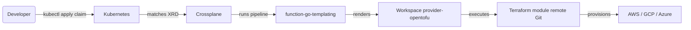
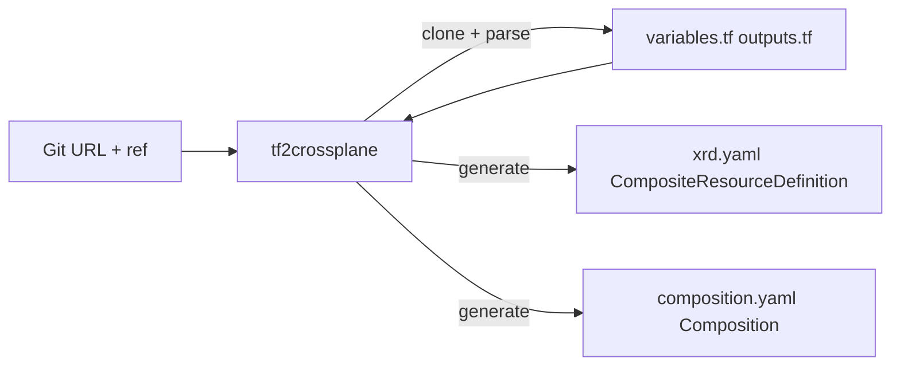
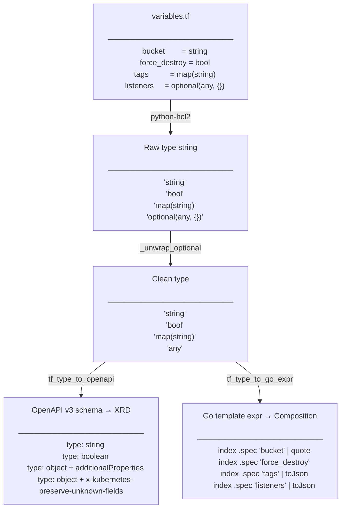

# tf2crossplane

Generate Crossplane **XRD** + **Composition** manifests from a Terraform module Git URL — no manual YAML writing.

## The problem

Crossplane's [provider-opentofu](https://github.com/upbound/provider-opentofu) lets you drive Terraform modules from Kubernetes. The runtime workflow looks like:



But writing a `CompositeResourceDefinition` and a `Composition` by hand for each module is tedious:

- parse every `variable {}` block in the module
- translate each Terraform type (`string`, `list(object(...))`, …) to an OpenAPI v3 schema fragment (required by Kubernetes CRD validation)
- wire each variable to its Go template expression in the `varmap`

For a module with 90 variables this is hundreds of lines of error-prone boilerplate. `tf2crossplane` automates all of it.



## What it generates

Given a module URL, `tf2crossplane` produces two files:

| File | Content |
|------|---------|
| `xrd.yaml` | `CompositeResourceDefinition` — declares the API (group, kind, schema) |
| `composition.yaml` | `Composition` — pipeline step using `function-go-templating` to render a `Workspace` |

The generated `Composition` uses [`function-go-templating`](https://github.com/crossplane-contrib/function-go-templating) (not patch-and-transform), which produces compact and readable output.

## Prerequisites

On the Crossplane cluster:

- `provider-opentofu` installed and a `ProviderConfig` configured
- `function-go-templating` installed

## Getting started

This walkthrough generates a Crossplane API for the [terraform-aws-alb](https://github.com/terraform-aws-modules/terraform-aws-alb) module and deploys an Application Load Balancer with a single claim.

### 1. Generate the manifests

```bash
tf2crossplane \
  --module-url 'git::https://github.com/terraform-aws-modules/terraform-aws-alb.git?ref=v9.13.0' \
  --output-dir out/alb/ \
  --group platform.example.io \
  --kind ApplicationLoadBalancer \
  --provider-config aws-prod
```

Output:
```
out/alb/
├── xrd.yaml          # CompositeResourceDefinition (46 variables, 11 outputs)
└── composition.yaml  # Composition (function-go-templating pipeline)
```

### 2. Install the API on your cluster

```bash
kubectl apply -f out/alb/xrd.yaml
kubectl apply -f out/alb/composition.yaml
```

### 3. Create a claim

```yaml
# alb-claim.yaml
apiVersion: platform.example.io/v1alpha1
kind: ApplicationLoadBalancer
metadata:
  name: my-alb
  namespace: my-team
spec:
  providerConfig: aws-prod
  name: my-alb
  vpc_id: vpc-0abc1234def56789
  subnets:
    - subnet-0aaaa111
    - subnet-0bbbb222
  load_balancer_type: application
  internal: false
  enable_deletion_protection: false
  tags:
    env: staging
    team: my-team
```

```bash
kubectl apply -f alb-claim.yaml
kubectl get applicationloadbalancer my-alb -n my-team
```

Crossplane will reconcile the claim → run the Composition → execute the Terraform module → provision the ALB on AWS.

## Installation

**From a GitHub release** (replace `<version>` with the [latest release](https://github.com/cdelgehier/tf2crossplane/releases/latest)):
```bash
pip install https://github.com/cdelgehier/tf2crossplane/releases/download/v<version>/tf2crossplane-<version>-py3-none-any.whl
```

**From source (requires [uv](https://docs.astral.sh/uv/)):**
```bash
git clone https://github.com/cdelgehier/tf2crossplane.git
cd tf2crossplane
uv sync
```

## Usage

```
tf2crossplane --module-url <git-url> [OPTIONS]
```

| Option | Default | Description |
|--------|---------|-------------|
| `--module-url` | *(required)* | Git URL of the Terraform module, with `?ref=` |
| `--output-dir` | `.` | Directory where `xrd.yaml` and `composition.yaml` are written |
| `--group` | `example.crossplane.io` | Crossplane API group — a reverse-DNS domain that namespaces your API (e.g. `platform.mycompany.com`). Pick one per platform, not per module. |
| `--version` | `v1alpha1` | API version |
| `--kind` | *(auto-detected)* | Override the CamelCase kind (e.g. `S3Bucket`) |
| `--provider-config` | `my-provider-config` | Name of the `ProviderConfig` resource on the cluster that holds the cloud credentials (AWS role, GCP SA, …). Injected as the default value for `spec.providerConfig` in the XRD — each claim can override it to target a different account. |
| `--provider-config-kind` | `ProviderConfig` | Kind for `providerConfigRef` in the generated Workspace. Use `ProviderConfig` for namespace-scoped setups and `ClusterProviderConfig` for cluster-scoped setups. |
| `--composition-update-policy` | `Automatic` | `defaultCompositionUpdatePolicy` in the XRD. `Automatic` means composites always follow the latest revision; `Manual` lets you control rollout per composite. |
| `--scope` | `Namespaced` | Scope of the XRD. `Namespaced` (Crossplane v2+) for namespace-scoped composites; `Cluster` for cluster-scoped resources. |
| `--function-go-templating` | `function-go-templating` | Name of the `function-go-templating` Function installed on the cluster. Override if installed under a different name (e.g. `upbound-function-go-templating`). |
| `--function-auto-ready` | `function-auto-ready` | Name of the `function-auto-ready` Function installed on the cluster. Override if installed under a different name. Only used when `--auto-ready` is set. |
| `--auto-ready/--no-auto-ready` | `true` | Append a `function-auto-ready` step to the pipeline so composed resource readiness propagates to the composite. Requires `function-auto-ready` installed on the cluster. |

### Examples

**S3 bucket:**
```bash
tf2crossplane \
  --module-url 'git::https://github.com/terraform-aws-modules/terraform-aws-s3-bucket.git?ref=v4.6.0' \
  --output-dir out/s3/ \
  --group platform.example.io \
  --kind S3Bucket
```

**Auto Scaling Group (93 variables, nested `optional()` types):**
```bash
tf2crossplane \
  --module-url 'git::https://github.com/terraform-aws-modules/terraform-aws-autoscaling.git?ref=v8.3.0' \
  --output-dir out/asg/ \
  --group platform.example.io \
  --kind AutoScalingGroup
```

**Module in a subdirectory of a mono-repo (the `//` separator):**

Some Terraform registries publish multiple modules in a single Git repo (e.g. `terraform-aws-iam`). Use the Terraform `//` subdir syntax to point at the right folder:

```bash
tf2crossplane \
  --module-url 'git::https://github.com/terraform-aws-modules/terraform-aws-iam.git//modules/iam-role?ref=v6.4.0' \
  --output-dir out/iam-role/ \
  --group platform.example.io \
  --kind IAMRole
```

`tf2crossplane` splits the URL at `//`, clones only the repo root, then parses `variables.tf` / `outputs.tf` from the subdirectory. The full URL (including `//`) is preserved verbatim in the generated `Composition` so that `provider-opentofu` fetches the correct submodule at runtime.

### Applying the output

```bash
kubectl apply -f out/s3/xrd.yaml
kubectl apply -f out/s3/composition.yaml
```

Then create a claim:

```yaml
apiVersion: platform.example.io/v1alpha1
kind: S3Bucket
metadata:
  name: my-bucket
spec:
  providerConfig: my-provider-config
  bucket: my-unique-bucket-name
  force_destroy: false
```

## Type mapping

Each Terraform variable goes through two independent transformations — one for the XRD schema, one for the Composition template:



Reference table:

| Terraform type | OpenAPI schema | Go template filter |
|----------------|----------------|--------------------|
| `string` | `{type: string}` | `\| quote` |
| `number` | `{type: number}` | *(direct)* |
| `bool` | `{type: boolean}` | *(direct)* |
| `list(X)` / `set(X)` | `{type: array, items: …}` | `\| toJson` |
| `map(X)` | `{type: object, additionalProperties: …}` | `\| toJson` |
| `object({…})` | `{type: object, x-kubernetes-preserve-unknown-fields: true}` | `\| toJson` |
| `optional(X)` | *(unwrap, recurse on X)* | *(unwrap, recurse on X)* |
| `any` / unknown | `{type: object, x-kubernetes-preserve-unknown-fields: true}` | `\| toJson` |

## Development

Requires [uv](https://docs.astral.sh/uv/) and [Task](https://taskfile.dev/).

```bash
task install       # install dependencies (including dev)
task test          # run tests with coverage
task lint          # ruff check
task fmt           # ruff format
task ci            # lint + format check + tests
task generate-s3   # generate example output for terraform-aws-s3-bucket
task generate-asg  # generate example output for terraform-aws-autoscaling
```

Tests live in `tests/` and cover the parser (type conversion), XRD generation, and Composition generation. No real Git clone happens during tests — fixtures in `conftest.py` simulate `parse_variables()` output.

## Log level

```bash
TF2CROSSPLANE_LOG_LEVEL=DEBUG tf2crossplane --module-url ...
```
