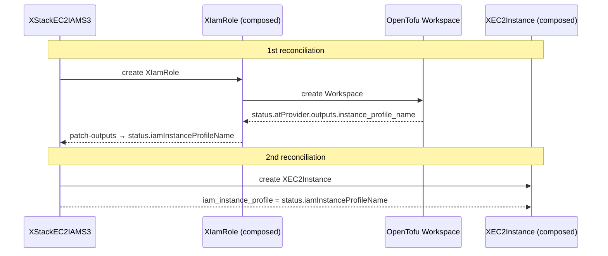

# Example: StackEC2IAMS3

This example extends StackIAMS3 by adding an EC2 instance. It shows the **wires**
feature: the instance profile name produced by the IAM workspace is automatically
injected into the EC2 resource — no manual two-pass required.

## What this example demonstrates

| Feature | Where to look |
|---------|--------------|
| Wire an output from one resource to another | `stack/stackec2iams3.stack.yaml` → `wires:` section |
| Output bubbled up to XR status | `stack/xrd.yaml` → `status.properties.iamInstanceProfileName` |
| `patch-outputs` pipeline step | `stack/composition.yaml` → `step: patch-outputs` |
| Optional IAM with 3 modes | `xr-stackec2iams3.yaml` and `xr-stackec2iams3-existingid.yaml` |

## Files

```
stackec2iams3/
├── infra/
│   ├── ec2/            # XEC2Instance XRD + Composition (terraform-aws-ec2-instance v6.3.0)
│   └── iam/            # XIamRole XRD + Composition (terraform-aws-iam v6.4.0)
├── stack/
│   ├── stackec2iams3.stack.yaml   # Stack definition — edit this
│   ├── xrd.yaml                   # Generated — do not edit
│   └── composition.yaml           # Generated — do not edit
├── xr-stackec2iams3.yaml          # Claim: Crossplane creates the IAM role
└── xr-stackec2iams3-existingid.yaml  # Claim: reuse an existing IAM role (not managed)
```

## Prerequisites

- Crossplane with `function-go-templating`, `function-patch-and-transform`, and
  `function-auto-ready` installed
- Infra XRDs deployed (`infra/ec2/` and `infra/iam/`)
- A ProviderConfig named `aws-personal-eu-west-1`
- **Infra compositions must propagate workspace outputs to XR status** (see note below)

## How wires work



> **Note:** For wires to work end-to-end, the infra IAM composition must propagate
> workspace outputs to the XIamRole XR status. This requires regenerating the infra
> compositions with output propagation.

## Key things to read

**`stack/stackec2iams3.stack.yaml`**
- `wires:` at the bottom declares that `iam.outputs.instance_profile_name` is
  injected into `ec2.iam_instance_profile` automatically.
- Because the wire sets `iam_instance_profile`, you do not list it under
  `ec2.expose:` — if you did, the field would appear twice and conflict.

**`stack/xrd.yaml`**
- `status.iamInstanceProfileName` is generated because of the wire. After the
  first reconciliation, you can read the resolved instance profile name here —
  for example with `kubectl get xstackec2iams3 my-app -o jsonpath='{.status.iamInstanceProfileName}'`.

**`stack/composition.yaml`**
- In the EC2 template block, `iam_instance_profile` reads from
  `status.iamInstanceProfileName`. If the status is empty (first cycle, not yet
  resolved) it falls back to `spec.iam.existingId` — so the `existingId` mode
  (see `xr-stackec2iams3-existingid.yaml`) still works: you pass the instance
  profile name directly via that field.
- The `patch-outputs` step copies `iam.status.atProvider.outputs.instance_profile_name`
  up to the XR status so the EC2 block can read it in the next reconciliation cycle.

**`xr-stackec2iams3-existingid.yaml`**
- Shows the reference mode: `spec.iam.existingId` is set, so Crossplane does not
  create an IAM role. The EC2 gets `iam_instance_profile` from this field directly.

## Regenerate

```bash
task example:stackec2iams3
```
