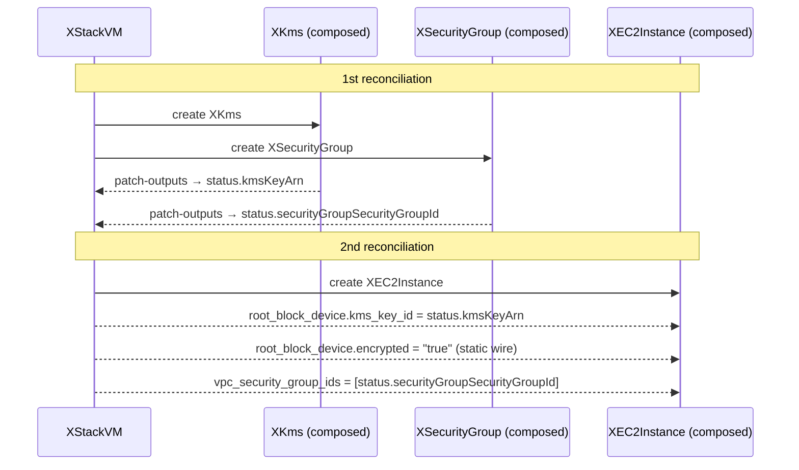

# Example: StackVM

This example shows a VM stack equivalent to CMA's `stack-vm`. It demonstrates two
advanced wire features: **array targets** and **nested object targets**.

## What this example demonstrates

| Feature | Where to look |
|---------|--------------|
| Wire output into a nested object field | `stack/stackvm.stack.yaml` → `target: ec2.root_block_device.kms_key_id` |
| Wire output into an array field | `stack/stackvm.stack.yaml` → `target: ec2.vpc_security_group_ids` |
| Static wire (literal value, no source) | `stack/stackvm.stack.yaml` → `static: "true"` + `target: ec2.root_block_device.encrypted` |
| Optional resource (KMS) with existingId mode | `xr-stackvm.yaml` → `spec.kms:` |
| `patch-outputs` pipeline step | `stack/composition.yaml` → `step: patch-outputs` |

## Files

```
stackvm/
├── infra/
│   ├── kms/              # XKms XRD + Composition (terraform-aws-kms v4.2.0)
│   ├── security-group/   # XSecurityGroup XRD + Composition (terraform-aws-security-group v5.3.1)
│   └── ec2/              # XEC2Instance XRD + Composition (terraform-aws-ec2-instance v6.3.0)
├── stack/
│   ├── stackvm.stack.yaml   # Stack definition — edit this
│   ├── xrd.yaml             # Generated — do not edit
│   └── composition.yaml     # Generated — do not edit
└── xr-stackvm.yaml          # Example claim
```

## Prerequisites

- Crossplane with `function-go-templating`, `function-patch-and-transform`, and
  `function-auto-ready` installed
- Infra XRDs deployed (`infra/kms/`, `infra/security-group/`, `infra/ec2/`)
- A ProviderConfig named `aws-personal-eu-west-1`
- Infra compositions must propagate workspace outputs to XR status

## How wires work



## Key things to read

**`stack/stackvm.stack.yaml`**
- `target: ec2.root_block_device.kms_key_id` — nested target: the wire injects
  `kms_key_id` inside the `root_block_device` object, not at the top level.
- `target: ec2.vpc_security_group_ids` — array target: the wire renders as a
  YAML list item (`- {{ value }}`), not a bare scalar.
- `static: "true"` + `target: ec2.root_block_device.encrypted` — static wire:
  injects a literal value without a dynamic source. Required by AWS when
  `kms_key_id` is set (`InvalidParameterDependency: KmsKeyId requires Encrypted`).
- `kms` is `optional: true` — supports `existingId` mode to reuse an existing key.

**`stack/composition.yaml`**
- EC2 template block renders:
  ```yaml
  vpc_security_group_ids:
    - {{ (.observed.composite.resource.status.securityGroupSecurityGroupId | default ...) }}
  root_block_device:
    kms_key_id: {{ (.observed.composite.resource.status.kmsKeyArn | default ...) }}
  ```
- The `patch-outputs` step bubbles `kms.status.atProvider.outputs.key_arn` and
  `security_group.status.atProvider.outputs.security_group_id` up to XR status.

## Regenerate

```bash
task example:stackvm
```
